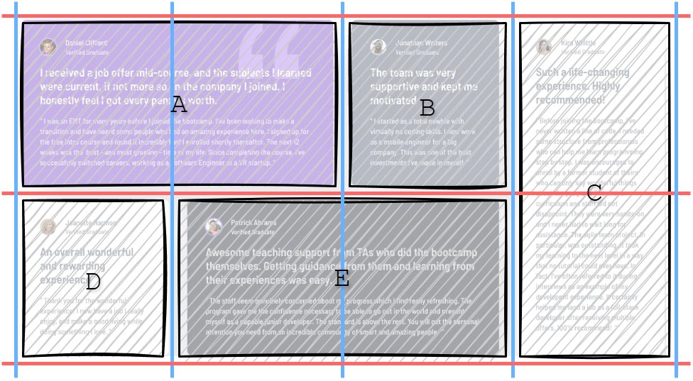

# Frontend Mentor - Testimonials grid section solution

This is a solution to the [Testimonials grid section challenge on Frontend Mentor](https://www.frontendmentor.io/challenges/testimonials-grid-section-Nnw6J7Un7). Frontend Mentor challenges help you improve your coding skills by building realistic projects. 

## Table of contents

- [Overview](#overview)
  - [The challenge](#the-challenge)
  - [Screenshot](#screenshot)
  - [Links](#links)
- [My process](#my-process)
  - [Built with](#built-with)
  - [What I learned](#what-i-learned)
- [Author](#author)

## Overview

### The challenge

Users should be able to:

- View the optimal layout for the site depending on their device's screen size

### Screenshot


### Links

- Solution URL: [View Solution on Frontend Mentor](https://www.frontendmentor.io/solutions/responsive-testimonials-section-made-with-grid-template-areas-BM_HSuq0U-)
- Live Site URL: [View Live Site](https://alexander3717.github.io/TestimonialsGrid/)


## My process

### Built with

- Semantic HTML5 markup
- SASS features
- CSS Grid
- Mobile-first workflow

### What I learned

It's possible to easily position items on a CSS grid using the `grid-template-areas` property.

```scss
main {
    grid-template-columns: repeat(4, 1fr);

    grid-template-areas:
    "A A B C"
    "D E E C";
}  
```

This defines a 2x4 grid:

- Item A spans the first two columns of the first row
- Item B sits in the third column of the first row
- Item C spans the last column across both rows
- Item D is placed in the first column of the second row
- Item E spans the middle two columns in the second row

Here's how it looks:

<br>

Now you just need to connect the grid items with the template above by labeling them with the names you used in the template (in this case we chose just A, B, C, D, E). The labeling is done through the `grid-area` property:

```scss
.testimonial_A {
    grid-area: A;
    // this says that we want the element with class testimonial_A 
    // to be placed in the "A" area defined in the grid-template
}
.testimonial_B {
    grid-area: B;
}
.testimonial_C {
    grid-area: C;
}
.testimonial_D {
    grid-area: D;
}
.testimonial_E {
    grid-area: E;
}
```

Add the desired row and column gaps and your grid is basically ready.

## Author

- Frontend Mentor - [@Alexander3717](https://www.frontendmentor.io/profile/Alexander3717)
